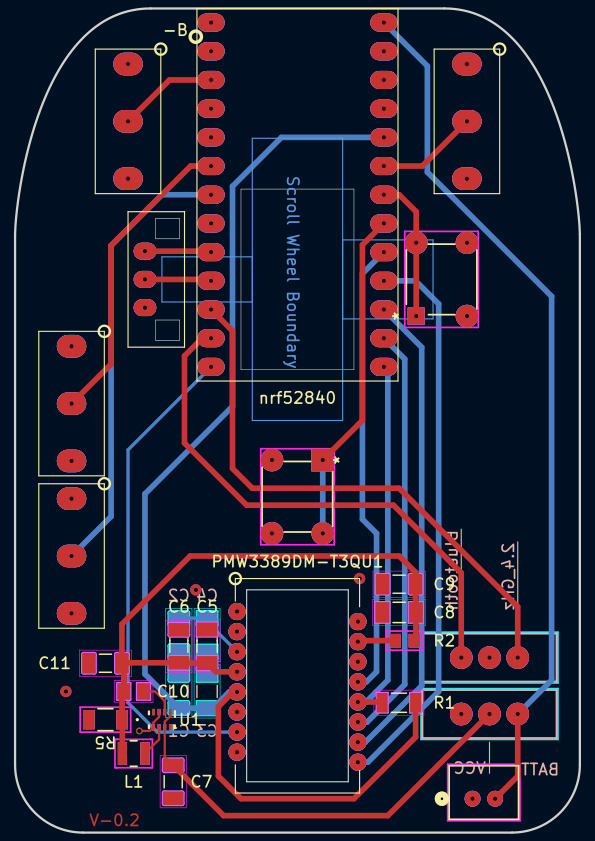
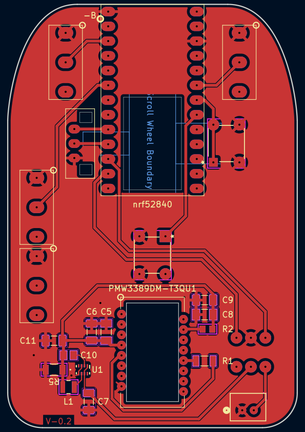
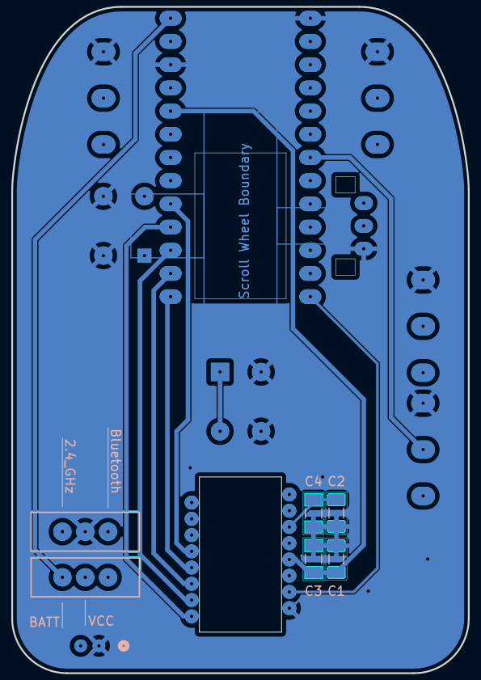

# Custom Wireless Mouse

This project contains software and hardware designs for a custom wireless mouse. This is an initial prototype intended for me to learn about hardware design and embedded software development. I combined hardware and software files into one repository for easier management. As of 2026-04-21, the design supports basic mouse functionality, including movement, button presses, and scrolling, and is powered by a 3.7V Li-ion battery, rechargeable via USB-C.

## File Structure

```
Mouse/
├── Documents/        # Datasheets, bootloader UF2, 3D models
├── Guide/
│   └── README.md     # New machine setup guide
├── KiCad/            # PCB schematics and layout
└── Software/
    ├── PROJECT_GUIDE.md  # Architecture, task tracking, module reference
    └── ...
```

- `Documents` contains datasheets, reference layouts, and documentation for the nRF Connect SDK and Zephyr project.
- `Guide` contains the new machine setup guide (`Guide/README.md`) and dated snapshots of known-good board/config files.
- `KiCad` contains the KiCad project files for the PCB design (schematics, PCB layout, Gerber files).
- `Software` contains firmware source, board definitions, and configuration files. See `Software/PROJECT_GUIDE.md` for details.

## Hardware Design

The hardware design is based on the nRF52840 because of its popularity/availability, built in Bluetooth, low power consumption, and integration with the nRF SDK for software development. The PCB was designed using KiCad and currently relies on a nRF52840 nice!nano microcontroller for higher level development in the early stages. The microcontroller includes a USB-C port for charging and firmware flashing, a charging protection circuit, and enough GPIO for this project. The design also includes a PMW3389 optical sensor for mouse movement, which is supported by the nRF SDK and Zephyr.

### PCB Images

| Full | Front | Back |
|:---:|:---:|:---:|
|  |  |  |

## Software Design

The software is developed using the nRF Connect SDK, which is based on the Zephyr RTOS. The nRF Connect VS Code extension is used for development, which provides a convenient interface for firmware development. The base structure is copied directly from the nRF Desktop sample project, which provides a good starting point for developing a Bluetooth mouse. The sample provides support for Bluetooth connectivity, mouse movement, button presses, and scrolling out of the box, with additional features available to be toggled on/off using the Kconfig GUI. The sample also provides sample mouse configurations as well as a PMW3360 driver, which is similar to the PMW3389. These files serve as a reference for the development of custom hardware and application files for the custom mouse.

## Current Problems

As of 2026-04-27 there are a couple major issues. The primary issue is the nice!nano board itself. While it was a good microcontroller to get started with this project and to learn about the basics, it was sometimes difficult to work with. Even though there are SWD pads on the back of the board, I could not get it to work with my nRF52840-DK. I also could not get bluetooth to work on the nice!nano, which is why I switched to the nRF52840-dongle for the most recent development. The dongle is meant to be a receiver, but it has enough gpio to connect everything; and since it is a nordic product, development was much easier.

The second problem was with the pmw3389 sensor. I have not figured out why it was not working with my PCB, but I was able to get it working with a breakout board. A multimeter showed that the voltage at the VDD pin was not stable and would start below 1.9V, then rise to above 1.9V. This leads me to believe my step-down circuit is wrong; either I got the calculations for the resistors and capacitors wrong, or the buck converter was not soldered properly. I used a microscope and the connections looked good, but it is very small so it's possible there is a cold solder joint or something else I missed.

## Future Improvements

The next step is to design the PCB without the nice!nano which will require using the nRF52840 SoC directly. This will involve further researching the nRF52840 for proper implementation as well as designing power management and charging circuits. I will also need to decide on whether to use an SoC with an included antenna or design one myself.

Becasue of the problems with the pmw3389, I will not use the TPS62821DLCR buck converter. I will probably use a linear step-down regulator instead, which will be less efficient but much simpler to implement.

On the software side, the next step is to develop custom application code for the mouse which will allow users to customize the behavior of the mouse, such as button mapping and sensitivity settings.
